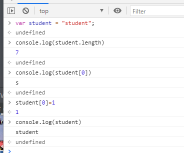
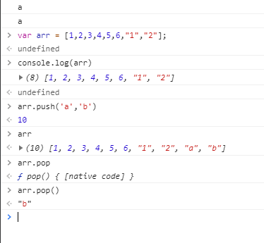
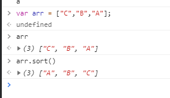
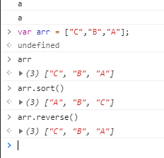
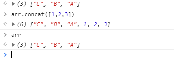

数据类型

‘abc’    "abc" 均可


布尔值

true   false


逻辑运算

```javascript
&& 两个都为真，结果为真

|| 一个为真

！  真即真，假即假
```


比较运算符

```javascript
=
==   等于（类型不一样，值一样，也会判断为true）
===  绝对等于（类型一样，值一样，结果为true）
```

JS的一个缺陷，这个于所有的数值都不相等，包括自己

只能通过isNaN（NaN）来判断这个数否是NaN


浮点数

```js
console.log((1/3)===(1-2/3));
```

尽量避免使用浮点数进行运算，存在精度问题

```javascript
console.log(Math.abs(1/3)===(1-2/3));
```


null和undefine

null 空

undefine 未定义的


数据

```javascript
var arr = [1,2,3,e,e,null,undefined];
```


对象

对象是大括号，数组是中括号

每个属性之间使用逗号隔开，最后一个不需要添加

```javascript
var person = {
	name:"wjp",
    age:3,
    tags:['js','java','web','...']
}
```


取对象的值

```javascript

```


## 3.数据类型

### 3.1 字符串

1.正常字符串我们使用 单引号，或者 双引号

2.注意转义字符

```javascript
\'
\n
\t
\u4e2d   \u#### unicode字符
\x41     ascii  字符
```


3.多行字符串编写

```javascript
//tab 上面 esc 下面
 var msg = `das
        dasda
        dada
        dada`

```


4.模板字符串

```javascript
//tab 上面 esc下面
  let name = "qingjiang";
let age = 3;
let msg = `你好呀，${name}`;
```


5.字符串长度

```javascript
str.length
```


6.字符串的可变性、不可变性



7.大小写转换

```javascript
student.toUpperCase()
student.toLowerCase()
```


### 3.2 数组

Array可以包含任意的数据类型

```javascript
var arr = [1,2,3,4,5,6];
arr[0]
arr[0]=1
```

1.长度

```javascript
arr.length
```

注意：加入给arr.length赋值，数组大小就会发生变化，赋值过小，元素就会丢失


2.indexof，通过元素获取下标索引

```javascript
arr.indexOf(2)
1
```

字符串的“1”和数字 1 是不同的

3.slice（）  截取Array的一部分，返回一个新数组

4.push   pop   



```javascript
push():压入到尾部
pop():弹出尾部的一个元素
```


5.unshift(),shift() 头部

```javascript
unshift：压入到头部
shift：弹出头部的一个元素
```


6.排序sort()




7.元素反转



```javascript
(3) ["A", "B", "C"]
arr.reverse()
(3) ["C", "B", "A"]
```


8.concat()



注意：concat() 并没有修改数组，只是返回一个新的数组。


9.连接符join

打印拼接数组，使用特定的字符串连接

```javascript
arr
(3) ["C", "B", "A"]
arr.join('-')
"C-B-A"
```


10.多维数组

```javascript
var arr = [[1,2],[3,4],["5","6"]];
undefined
arr[1][1]
4
```


数组：存储数据（如何存，如何取）


### 3.3 对象 


