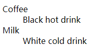

在整个html中，默认是从左到右（优先级高于从上到下），从上到


blockquoto：标记长的引用

```html
<blockquote>
This is a long quotation. This is a long quotation. 
This is a long quotation. This is a long quotation. This is a long quotation.
</blockquote>
请注意，浏览器在 blockquote 元素前后添加了换行，并增加了外边距。
```


layui中的实现

```html
    <div class="layui-container">
    <!-- 标记长的引用-->
        <blockquoto class="layui-elem-quote">注意：下述演示中的颜色只是做一个区分作用，并非栅格内置。</blockquoto>
    </div>
```

dl标签：带有项目和描述的描述列表

```javascript
<dl>
  <dt>Coffee</dt>
    <dd>Black hot drink</dd>
  <dt>Milk</dt>
    <dd>White cold drink</dd>
</dl>
```




在布局中，layui中关于div的设置，div均是以块元素的方式进行展示

```javascript
div {
    display: block;
}
```


有个小常识或者小技巧，在块元素中，height和line如果是一致的：height=line-height，那么可以得到的是只有一行字体的时候，可以实现元素垂直居中，与之形成对比的是，text-align 可以实现水平居中


